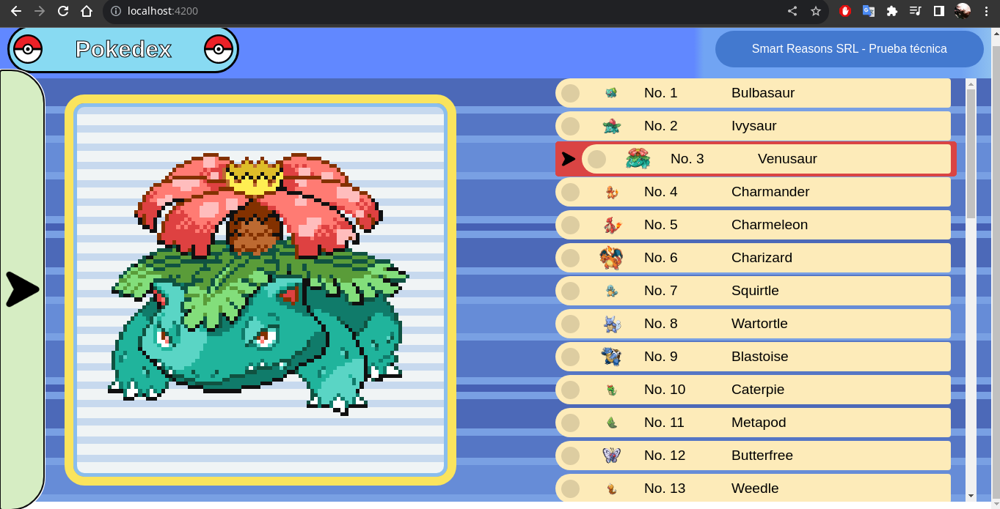
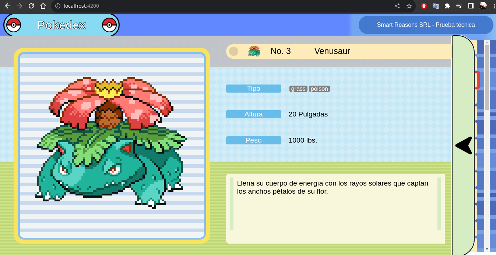

# Pokedex
Prueba técnica para el puesto de desarrollador junior.

 - Realizado con la RESTful API [POKEAPI](https://pokeapi.co/).

## DEMO EN VIVO

- Demo del proyecto desplegado en github pages https://hermogenes18.github.io/PokeApi-Front/

## DESCRIPCION

Proyecto realizado en Angular, la función del proyecto es emular una pokedex del juego pokemon.

- Lista de pokemon que se pueden seleccionar.

- Detalles de pokemon, seleccionando la flecha de la izquierda.

 
## RUN

Run `npm install` and  `ng serve`

 

This project was generated with [Angular CLI](https://github.com/angular/angular-cli) version 16.0.2.